# CoffeeRadar Codebase Analysis

**Date**: May 18, 2026  
**Scope**: Complete architecture, data flow, API integrations, code duplication, unused code  

---

## Executive Summary

CoffeeRadar is a **React Native activity suggestion engine** that generates personalized recommendations based on:
- Current time & calendar availability (via Expo Calendar)
- Location & nearby venues (Google Places, OpenStreetMap)
- User habits & preferences
- Historical swipe behavior (tag affinities)
- Real-time weather & events (Open-Meteo, Ticketmaster, SeatGeek)

**Key Finding**: The app has **well-structured modular architecture** but exhibits **moderate API sprawl** (8 integrations) and **unnecessary duplication** in location services (Google Places + OSM doing nearly identical work).

---

## 1. ARCHITECTURE OVERVIEW

### Project Structure
```
src/
├── screens/           16 screens (all active)
├── services/          22 service files
├── components/        12 UI components  
├── data/              6 curated suggestion files (~3.3k LOC)
├── state/             AppState context
├── types/             TypeScript definitions
├── utils/             Storage, habits, time helpers
└── theme/             Dark/light mode
```

### Technology Stack
- **Framework**: React Native 0.81 + Expo 54
- **Navigation**: React Navigation (stack)
- **State**: React Context + AsyncStorage + Firebase Firestore
- **Authentication**: Firebase Auth (email, Google, Apple Sign-In)
- **Styling**: React Native + Expo Linear Gradient
- **Platform splits**: `.native.ts` / `.web.ts` for platform-specific code

### Build Size & Complexity

| Category | Files | LOC | Notes |
|----------|-------|-----|-------|
| **Services** | 22 | ~3500 | Core business logic |
| **Screens** | 16 | ~4500 | UI layer |
| **Data** (curated) | 6 | ~3360 | Fallback suggestions |
| **Components** | 12 | ~1500 | Shared UI |
| **Types/Utils** | 6 | ~800 | Helpers |
| **TOTAL** | ~62 | ~14,000 | Manageable scope |

---

## 2. DATA FLOW ARCHITECTURE

### Suggestion → Habit → User Flow

```
┌─────────────────────────────────────────────────────────────────┐
│                        DECK BUILD PIPELINE                      │
└─────────────────────────────────────────────────────────────────┘

INPUTS:
  • User Location (lat/lng)  ──────┐
  • Calendar Availability    ──┐   │
  • User Preferences         ──┼──→├─→ buildDeck() [SuggestionService]
  • Habits (with streaks)    ──┼──→│
  • Tag Affinities          ──┼──→│
  • Weather                 ──┤   │
  • Location Profile        ──┘   └─→

PARALLEL FETCHES (2.5s timeout each):
  ├─ curated suggestions (atHome.ts, goOut.ts)
  ├─ user's habits (if due)
  ├─ Gemini AI suggestions (prefetch)
  ├─ Google Places (venues)
  ├─ Ticketmaster (events)
  ├─ SeatGeek (events)
  └─ OSM Overpass (venues)

PROCESSING PIPELINE:
  1. Filter by time-of-day
  2. Enrich curated with real venues (attachPlace mechanism)
  3. Compute feasibility (travel time, opening hours)
  4. Score by affinity, weather, novelty, convenience
  5. Interleaved deck assembly (round-robin by tag)

OUTPUT:
  DeckSuggestion[] (max 15 cards) → Rendered in DeckScreen

PERSISTENCE:
  ├─ AppState (memory)
  ├─ ActivityLog → localStorage → Firebase
  ├─ Habits → localStorage → Firebase (sync)
  ├─ TagAffinities → learned via swipes → localStorage → Firebase
  └─ SavedSuggestions → "save for later" → localStorage → Firebase
```

### Key Data Flows

**1. User Preference → Suggestion Matching**
- InterestTags + TagParents expansion (e.g., "cycling" → includes "fitness" suggestions)
- AllowSerendipity flag: yes = ignore tags; no = strict tag matching
- Lifestyle field (active/moderate/chill/mixed) → influences Gemini context

**2. Swipe Behavior → Tag Learning**
```
Event                      Weight   Decay
─────────────────────────────────────────
Swipe Right (accept)       +1.0     0.95/day
Complete (activity done)   +1.5     0.95/day  (strongest signal)
Mark Interested            +0.45    0.95/day
Swipe Left (reject)        −0.3     0.95/day
```
Scores stored per tag in `TagAffinities` map, used to weight deck scoring.

**3. Location Profile → Contextual Biasing**
```
Detection: 1-time Overpass query at startup
Classification: coastal/urban/suburban/unknown
Boosts: Tag multipliers (e.g., coastal → beaches +0.15)
Re-detect: Only when user moves >5 km
```

**4. Availability → Feasibility Filtering**
```
AT_HOME: durationMin ≤ availabilityDurationMin
GO_OUT: eta + durationMin + 10min buffer ≤ availabilityDurationMin
EVENT:  (currentTime < eventStart < availabilityEnd) 
        AND hasTicketUrl AND minutesUntil ≤ 180
```

---

## 3. LIST OF ALL SERVICES

### Core Services (Active Daily)

| Service | Purpose | API Key | Caching | Status |
|---------|---------|---------|---------|--------|
| **calendar.{native,web}.ts** | Calendar availability, event creation | None | Live | ✅ Core |
| **location.{native,web}.ts** | Current location + reverse geocoding | None | Live | ✅ Core |
| **suggestions.ts** | Deck building orchestration | None | N/A | ✅ Core (980 LOC) |
| **affinity.ts** | Tag scoring + decay algorithm | None | Memory | ✅ Core |
| **travel.ts** | Distance calc, ETA estimation, travel mode | None | Computed | ✅ Core |
| **firebase.ts** | Firebase initialization + client refs | Env vars | N/A | ✅ Core |
| **auth.ts** | Email, Google, Apple auth flows | Env vars | Session | ✅ Core |
| **weather.ts** | Open-Meteo weather fetch + indoor bias | None | 15 min | ✅ Core |
| **user.ts** | Firestore CRUD (habits, affinities, prefs) | None | Network | ✅ Core |

### Place Discovery Services (API-Dependent)

| Service | API | Purpose | LOC | API Key | Timeout | Status |
|---------|-----|---------|-----|---------|---------|--------|
| **googlePlaces.ts** | Google Places Nearby Search | Venues | 403 | Required | 2.5s | ⚠️ Active |
| **osmPlaces.ts** | OpenStreetMap (Overpass) | Venues (free alt) | 512 | None | 2.5s | ⚠️ Active |
| **ticketmaster.ts** | Ticketmaster Discovery API | Events | 285 | Required | 2.5s | ⚠️ Secondary |
| **seatgeek.ts** | SeatGeek API | Events (backup) | 98 | Required | 2.5s | ⚠️ Experimental |
| **geminiSuggestions.ts** | Google Gemini 2.5 Flash | AI-generated suggestions | 482 | Required | 2.5s | ⚠️ Prefetch |

### Utility & Supporting Services

| Service | Purpose | LOC | Integration |
|---------|---------|-----|-------------|
| **locationProfile.ts** | Detect area type (coastal/urban/suburban) | 204 | Overpass query |
| **whyNow.ts** | Generate contextual copy for cards | 128 | Text templates |
| **notifications.ts** | Habit reminders + notification scheduling | 246 | Expo.Notifications |
| **analytics.ts** | Firebase event logging | 21 | Firestore analytics |
| **debug.ts** | In-app debug message log | 38 | Dev/QA only |

---

## 4. DATA MODEL & TYPE SYSTEM

### Core Types (src/types/index.ts)

```typescript
// Suggestion types
SuggestionType = 'AT_HOME' | 'GO_OUT' | 'EVENT'
Suggestion = {
  id, type, source ('ticketmaster'|'curated'|'habit'|'fallback'|'gemini')
  title, cta, hook, description, durationMin
  confidence, tags, emojis
  moodFit?, effortToStart? (1-5), timeOfDay?
  place?, event?, rating?, ratingCount?
  whyNow?, steps?, equipment?, instructions?
}

// User state
Habit = {
  id, name, type ('AT_HOME'|'GO_OUT'), lengthMin, frequency, timeOfDay
  currentStreak, longestStreak, completionHistory (ISO timestamps)
}

SavedSuggestion = {
  id, savedAt (ISO), source ('saved_later'|'interest_signal'), suggestion
}

ActivityLog = {
  id, suggestionId, title, durationMin, timestamp, source, habitId?
}

// Learned preferences
TagAffinities = Record<string, number>  // {tag: score}
LocationProfile = {
  label ('coastal'|'urban'|'suburban'|'unknown')
  boosts (tag → number)
  lat, lng, detectedAt (ISO)
}

// User profile
UserPrefs = {
  openToGoingOut, allowSerendipity, radiusKm
  interestTags[], customInterests?
  lifestyle? ('active'|'moderate'|'chill'|'mixed')
  selfDescription?, themeMode ('light'|'dark')
}
```

### Data Model Issues & Gaps

| Issue | Impact | Severity |
|-------|--------|----------|
| **Redundant fields in DeckSuggestion** | `openStatus`, `opensInMin`, `closesInMin` exist in both Suggestion AND meta | ⚠️ Medium (increases payload) |
| **No rate-limit tracking** | No backoff for API failures; may hit rate limits | 🔴 High (production risk) |
| **ActivityLog misses source detail** | Should track Google Places vs OSM vs Ticketmaster | ⚠️ Medium (analytics) |
| **No cache invalidation timestamps** | Stale data possible if user moves but cache not cleared | ⚠️ Medium (correctness) |
| **HabitFrequency not aligned with ISO weeks** | "fortnightly" = hardcoded 14 days, no locale awareness | ⚠️ Low |
| **Confidence score rarely used** | Present in Suggestion, rarely impacts scoring | ⚠️ Low |

---

## 5. CODE DUPLICATION ANALYSIS

### 🔴 CRITICAL: Google Places vs OSM (Duplicate Effort)

Both services do nearly identical work:

```
Google Places                           OSM Overpass
───────────────────────────────────────────────────────
1. nearbysearch API call                1. Overpass QL query
2. Parse results (place_id, name, etc)  2. Parse results (id, name, etc)
3. Map types → tags (restaurant→food)   3. Map tags → tags (cafe→coffee)
4. Fetch details/opening hours          4. Parse opening hours (OH string)
5. Build description blurbs             5. Build description blurbs
6. Compute confidence scoring           6. Compute confidence scoring
7. Return Suggestion[] with ratings     7. Return Suggestion[] with ratings
```

**Duplication Score**: ~70% code overlap  
**Impact**: 
- 403 LOC (Google) + 512 LOC (OSM) = 915 LOC for same job
- Business logic split across two files
- Bug fixes must happen in both places
- Inconsistent scoring/blurb generation

**Recommendation**: 
- **Consolidate** into single `venueService.ts` with pluggable backends
- Keep Overpass as free fallback when Google quota exceeded
- Unified response + tag mapping

### ⚠️ MEDIUM: Platform Abstraction (Not Duplication)

`calendar.native.ts` vs `calendar.web.ts` (33 LOC vs 48 LOC):
- Necessary platform split (Expo Calendar unavailable on web)
- Web returns stub implementations
- **Currently acceptable** — platform differences justified

`location.native.ts` vs `location.web.ts` (31 LOC vs 14 LOC):
- Similarly justified
- Web version is intentionally disabled

### ⚠️ MEDIUM: Event Fetching (Ticketmaster vs SeatGeek)

Both `ticketmaster.ts` (285 LOC) and `seatgeek.ts` (98 LOC) fetch events:
- Different APIs but overlapping intent
- Used in parallel with 2.5s timeout
- Both return EVENT suggestions with venue + pricing
- Only Ticketmaster actively used in UI (SettingsScreen debug)
- **SeatGeek appears experimental/unused** in main deck flow

**Recommendation**:
- Decide: Ticketmaster OR SeatGeek, not both
- If keeping both, abstract into `eventService.ts` with fallback chain
- Currently: ~383 LOC for overlapping functionality

### ✅ GOOD: Tag/Type Mapping Consistency

- `geminiSuggestions.ts`, `GooglePlaces.ts`, `osmPlaces.ts` all have similar:
  ```typescript
  INTEREST_TYPE_MAP, SEGMENT_TAG_MAP, TAG_PRIORITY, TAG_APPEAL
  ```
- These are **intentionally local** to preserve service independence
- No centralization needed (each API has unique category schemas)

---

## 6. DEAD/UNUSED CODE

### 🔴 Unused Services

| Service | Evidence | Recommendation |
|---------|----------|-----------------|
| **seatgeek.ts** | Imported only in SettingsScreen (debug testing), never in buildDeck | ⚠️ Remove or merge with Ticketmaster |
| **mapPlaces services** | MapThumbnail.native/web exist but not fully integrated in Plan view | ⚠️ Stub implementation |

### ⚠️ Partially Integrated

| Feature | Status | Notes |
|---------|--------|-------|
| **LocationProfile** | Detected at startup but rarely influences deck | Uses only ~0.15 boost cap; not aggressive learning |
| **EffortToStart (1-5)** | Present in Gemini responses, ignored in scoring | Could amplify "low effort" suggestions for fatigued users |
| **MoodFit array** | Returned by Gemini, never used in filtering | "low/okay/good/high/anxious/bored/surprise" unused |
| **Badges system** | Full BadgeDetailScreen + badges.ts (74 LOC), minimal integration | Aesthetic reward, not functional |

### 📋 Unused Screens (All 16 in Use)

All screens are actively routed in App.tsx and used:
- **Onboarding**: Welcome → CalendarPermission → CalendarSelect → LocationPermission → Preferences → Home
- **Main flow**: Home → Deck → Plan → Completion
- **Sidebar**: Settings, Profile, Habits, Library, BadgeDetail

**Status**: ✅ No unused screens

---

## 7. API INTEGRATION SPRAWL

### Third-Party Dependency Map

```
CoffeeRadar App
│
├─ Authentication (1)
│  └─ Firebase Auth (email, Google, Apple)
│
├─ Venue Discovery (2 APIs)
│  ├─ Google Places (API key required, paid)
│  └─ OpenStreetMap/Overpass (free, volunteer-run)
│
├─ Events (2 APIs)
│  ├─ Ticketmaster (API key required, paid)
│  └─ SeatGeek (API key required, experimental)
│
├─ Content Generation (1)
│  └─ Gemini 2.5 Flash (API key required, paid)
│
├─ Weather (1)
│  └─ Open-Meteo (free, no key)
│
├─ Backend (1)
│  └─ Firebase Firestore (user sync)
│
└─ Platform APIs (3)
   ├─ Expo.Calendar (native only)
   ├─ Expo.Location (native only)
   └─ Expo.Notifications (habit reminders)
```

### API Cost Analysis

| Service | Tier | Monthly Cost (est.) | Used For |
|---------|------|-------------------|----------|
| Google Places | Pay-as-you-go | $50–200/month | Venue discovery |
| Gemini API | $0.075 per 1M input tokens | ~$10–50/month | AI suggestions |
| Ticketmaster | Free with key | ~$0 (rate limited) | Event discovery |
| SeatGeek | Free with key | ~$0 (unused) | Event backup |
| Firebase | Pay-as-you-go | $10–30/month | Auth, Firestore, Analytics |
| Open-Meteo | Free | $0 | Weather |
| **TOTAL** | — | **~$70–300/month** | — |

### Recommendation

**Medium**: Reduce from 8 to 6 integrations:
- ✅ Keep: Firebase, Google Places, Gemini, Ticketmaster, Open-Meteo, Expo native
- ⚠️ Remove: SeatGeek (experimental, overlaps Ticketmaster)
- ⚠️ Evaluate: Keep OSM Overpass as fallback only (adds complexity, used when Google quota exhausted)

---

## 8. SERVICE DEPENDENCY GRAPH

```mermaid
graph TD
    AppState["AppState (Context)"]
    
    HomeScreen["HomeScreen"] -->|preloadDeck| AppState
    HomeScreen -->|getLocation| LocationService["location.{native,web}"]
    HomeScreen -->|getAvailability| CalService["calendar.{native,web}"]
    HomeScreen -->|fetchWeather| Weather["weather.ts"]
    HomeScreen -->|detectLocationProfile| LocProfile["locationProfile.ts"]
    HomeScreen -->|logEvent| Analytics["analytics.ts"]
    
    DeckScreen["DeckScreen"] -->|buildDeck| Suggestions["suggestions.ts"]
    DeckScreen -->|recordSwipe| Affinity["affinity.ts"]
    DeckScreen -->|createPlanEvent| CalService
    DeckScreen -->|logEvent| Analytics
    
    Suggestions -->|curated data| AtHome["atHome.ts, goOut.ts, etc"]
    Suggestions -->|venue enrichment| GooglePlaces["googlePlaces.ts"]
    Suggestions -->|venue enrichment| OSM["osmPlaces.ts"]
    Suggestions -->|events| Ticketmaster["ticketmaster.ts"]
    Suggestions -->|events alt| SeatGeek["seatgeek.ts (unused)"]
    Suggestions -->|AI suggestions| Gemini["geminiSuggestions.ts"]
    Suggestions -->|travel calcs| Travel["travel.ts"]
    Suggestions -->|why-now text| WhyNow["whyNow.ts"]
    Suggestions -->|affinity scores| Affinity
    
    GooglePlaces -->|external| GPlacesAPI["Google Places API"]
    OSM -->|external| OverpassAPI["Overpass API"]
    Ticketmaster -->|external| TicketmasterAPI["Ticketmaster API"]
    SeatGeek -->|external| SeatGeekAPI["SeatGeek API"]
    Gemini -->|external| GeminiAPI["Gemini 2.5 Flash API"]
    Weather -->|external| OpenMeteo["Open-Meteo API"]
    CalService -->|native| ExpoCal["Expo.Calendar"]
    LocationService -->|native| ExpoLoc["Expo.Location"]
    
    PlanScreen["PlanScreen"] -->|updateCalendar| CalService
    PlanScreen -->|logEvent| Analytics
    
    User["user.ts"] -->|sync habits| AppState
    User -->|external| Firestore["Firebase Firestore"]
    AppState -->|storage| Storage["localStorage"]
    AppState -->|sync| User
    
    Auth -->|external| FirebaseAuth["Firebase Auth"]
```



---

## 9. KEY FINDINGS & RECOMMENDATIONS

### 🔴 Critical Issues

| Issue | Impact | Fix |
|-------|--------|-----|
| **Google Places + OSM duplication** | 915 LOC doing same job; split bugs | Consolidate to `venueService.ts` abstraction |
| **No API rate-limit handling** | May fail under load | Add exponential backoff + circuit breaker |
| **Gemini prefetch fire-and-forget** | Unused responses discarded silently | Debug/log response usage |

### ⚠️ Medium Issues

| Issue | Impact | Fix |
|-------|--------|-----|
| **SeatGeek unused** | Dead code; maintenance burden | Remove or integrate fallback chain |
| **LocationProfile underused** | Detected but boost capped at 0.15 | Decide: amplify effect or remove feature |
| **EffortToStart/MoodFit ignored** | Gemini returns data that's thrown away | Use or remove from API schema |
| **Tag affinity decay slow** | 0.95/day means stale prefs persist | Consider faster decay (0.90) or user reset |

### ✅ Strengths

- **Clean separation of concerns**: Services, screens, state are well-isolated
- **Fallback layers**: Multiple venue sources (Google + OSM), multiple event sources
- **Type safety**: Comprehensive TypeScript definitions
- **State management**: AppState context handles all app data coherently
- **Caching strategy**: Smart 5–15 min caches for external APIs

---

## 10. UNUSED/EXPERIMENTAL FEATURES

### Features Present But Minimally Integrated

```typescript
// Effort to Start (Gemini returns, never used)
effortToStart?: 1 | 2 | 3 | 4 | 5;  
// Could gate suggestions: only show 5/5 effort if <5min left

// Mood Fit matching (returned, filtered in scoring? No.)
moodFit?: Array<'low' | 'okay' | 'good' | 'high' | 'anxious' | 'bored' | 'surprise'>;
// Could be used for fatigue-aware recommendations

// Equipment requirements (present, not surfaced in UI)
equipment?: string[];
// Could show in plan view or PlanScreen reminder

// Badges system (full screen + data, but minimal prominence)
badges.ts (74 LOC), BadgeDetailScreen (118 LOC)
// Rewards for streaks, but not deeply integrated

// Serendipity filter (allowSerendipity flag works but rarely toggled)
// Could auto-enable based on patterns or time-of-week
```

---

## 11. RECOMMENDATIONS SUMMARY

### Short Term (Quick Wins)

1. **Remove SeatGeek** — Experimental, unused, reduce maintenance
2. **Add rate-limit handling** — Firebase quotas, API quotas with backoff
3. **Log Gemini response usage** — Why are AI suggestions being ignored?
4. **Consolidate OSM + Google** — Single `venueService.ts` with fallback chain

### Medium Term (Refactor)

1. **Amplify LocationProfile** — Increase boost cap; profile detection is costly
2. **Use EffortToStart** — Filter suggestions by effort when availability ≤10 min
3. **Improve tag affinity decay** — Faster (0.90/day) or let users reset personalization
4. **Badges integration** — Tie to achievement milestones or habit engagement

### Long Term (Architecture)

1. **Abstract event service** → `eventService.ts` with Ticketmaster + fallback
2. **Cache strategy audit** → Centralize cache + invalidation logic
3. **Analytics expansion** → Track which suggestion sources convert (Gemini vs curated)
4. **Consider GraphQL** → Replace Firestore direct calls for better query optimization

---

## APPENDIX: File Sizes Summary

### Services (Top 10 by LOC)

```
980  suggestions.ts          (deck building orchestration)
512  osmPlaces.ts            (OpenStreetMap venue discovery)
482  geminiSuggestions.ts    (AI suggestions + caching)
403  googlePlaces.ts         (Google Places venue discovery)
285  ticketmaster.ts         (Event discovery)
246  notifications.ts        (Habit reminders + scheduling)
213  user.ts                 (Firestore CRUD operations)
204  locationProfile.ts      (Area classification)
176  auth.ts                 (Multi-factor auth flows)
129  calendar.native.ts      (Calendar integration)
```

### Data (Curated Suggestions)

```
1334 atHome.ts               (170+ at-home activities)
1081 fallback.ts             (generic fallbacks when APIs fail)
737  goOut.ts                (100+ go-out activities)
74   badges.ts               (achievement definitions)
68   events.ts               (template events)
66   habits.ts               (example habits)
─────────────────
3360 TOTAL
```

### Screens (Top 5 by LOC)

```
1788 HomeScreen.tsx          (primary feed + preload)
1066 DeckScreen.tsx          (swipe deck UI + affinity recording)
749  PlanScreen.tsx          (confirmation + calendar scheduling)
566  HabitsScreen.tsx        (habit management + streaks)
470  SettingsScreen.tsx      (settings + API debug testing)
4639 TOTAL (top 5 of 16)
```

---

**Document End**
